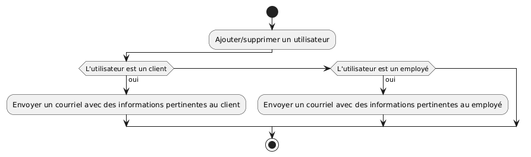
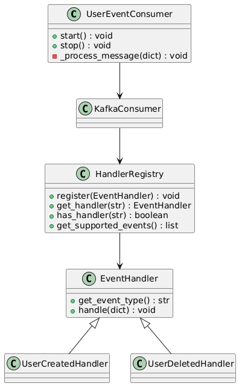
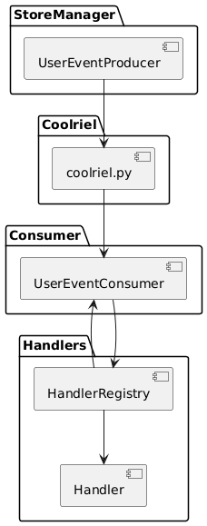
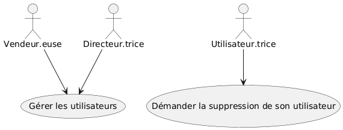
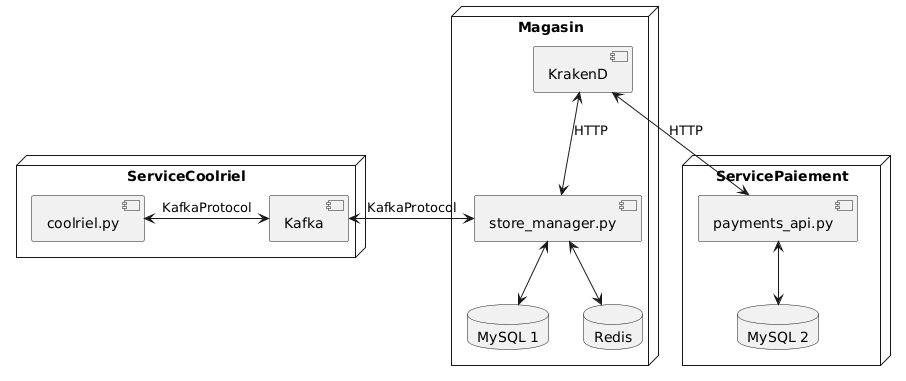

# Coolriel - Documentation d'Architecture

Ce document, basé sur le modèle arc42, décrit Coolriel, un microservice de notification d'utilisateurs par courriel (email). Dans le cadre du Labo 07, par simplicité, l'envoi de courriels en format HTML est seulement simulé dans l'application.

## 1. Introduction et Objectifs

### Panorama des exigences

Coolriel est un microservice « event-driven » de notification d'utilisateurs du Store Manager par courriel. Chaque fois qu'un utilisateur est ajouté ou supprimé, un événement est déclenché dans l'application, qui à son tour déclenche l'envoi d'un courriel à l'utilisateur correspondant. Cette application utilise :

- Une architecture événementielle avec Apache Kafka comme broker de messages
- Le patron Pub/Sub pour le découplage des composants
- L'event sourcing pour maintenir l'historique complet des événements
- La communication asynchrone (quand un événement est déclenché par Store Manager, l'application n'attend pas une réponse, elle continue son exécution)

Cette architecture permet une meilleure résilience, performance et flexibilité par rapport à l'approche avec des microservices qui se communiquent de façon synchrone.

### Objectifs qualité

| Priorité | Objectif qualité | Scénario                                                                         |
| -------- | ---------------- | -------------------------------------------------------------------------------- |
| 1        | **Découplage**   | Les services communiquent via événements sans dépendances directes               |
| 2        | **Résilience**   | La défaillance du service de notification n'affecte pas l'application principale |
| 3        | **Traçabilité**  | Event sourcing permet de reconstruire l'état à partir de l'historique            |
| 4        | **Évolutivité**  | Nouveaux consommateurs peuvent être ajoutés sans modifier les producteurs        |
| 5        | **Performance**  | Traitement asynchrone des notifications sans bloquer les opérations principales  |

### Parties prenantes (Stakeholders)

- **Développeurs** : Apprendre l'architecture event-driven, Kafka, et le patron Pub/Sub
- **Employés et Clients du magasin** : Être informés lorsque leur utilisateur est créé/supprimé (au cas où ils demanderaient explicitement une suppression)

## 2. Contraintes d'architecture

| Contrainte         | Description                                                                      |
| ------------------ | -------------------------------------------------------------------------------- |
| **Technologie**    | Python, Apache Kafka, Docker, MySQL                                              |
| **Message Broker** | Apache Kafka pour la gestion des événements asynchrones                          |
| **Persistance**    | Event sourcing avec rétention configurable dans Kafka (7 jours, max. 1GB)        |
| **Éducatif**       | Démontrer clairement les différences entre communication synchrone et asynchrone |

## 3. Portée et contexte du système

### Contexte métier

L'application Coolriel permet :

- **Notifications automatisées** : Génération des courriels HTML basés sur templates et personnalisés selon le type d'utilisateur et événement
- **Historique des événements** : Conservation et reconstruction de l'état de l'utilisateur via event sourcing
- **Communication asynchrone** : Découplage entre l'application Store Manager et les services de notification

### Contexte technique

- **Producteur d'événements** : Store Manager publiant sur Kafka
- **Broker de messages** : Apache Kafka avec un topic dédié aux données d'utilisateur (`user-events`)
- **Consommateur** : Coolriel

## 4. Stratégie de solution

| Problème             | Approche de solution                                                                                                                                                                                    |
| -------------------- | ------------------------------------------------------------------------------------------------------------------------------------------------------------------------------------------------------- |
| **Event-driven**     | Architecture avec Kafka comme intermédiaire entre Store Manager et Coolriel                                                                                                                             |
| **Scalabilité**      | Patron Pub/Sub permettant multiples producteurs et consommateurs                                                                                                                                        |
| **Personnalisation** | Templates de courriels HTML adaptables selon le besoin                                                                                                                                                  |
| **Historique**       | Event sourcing avec rétention configurée dans Kafka                                                                                                                                                     |
| **Résilience**       | Communication asynchrone **partiellement** tolérante aux pannes (ex. si Store Manager arrête, Kafka et Coolriel peuvent continuer à fonctionner, mais si Kafka arrête, Coolriel devient incommunicable) |
| **Évolution**        | Ajout de nouveaux handlers sans modification du producteur                                                                                                                                              |

## 5. Vue des blocs de construction

## 6. Vue d'exécution

## 7. Vue de déploiement

## 8. Concepts transversaux

- Event-Driven Architecture
- Producer/Consumer
- Publisher/Subscriber
- Event Sourcing

## 9. Décisions d'architecture

Veuillez consulter le fichier `/docs/adr/adr001.md`.

## 10. Exigences qualité

### Découplage

- Aucune dépendance directe entre producteur (Store Manager) et consommateur (Coolriel)
- Ajout/retrait de services sans impact sur les autres

### Résilience

- Coolriel peut fonctionner même sans Store Manager
- Kafka garantit la livraison des messages au moins une fois
- Consommateurs peuvent redémarrer sans perte de messages
- Kafka réessaye automatiquement en cas d'échec temporaire

### Performance

- Traitement asynchrone non-bloquant
- Parallélisation et batch processing possible (pas dans le cadre de ce labo)

### Traçabilité

- Tous les événements conservés pendant 7 jours (la durée est configurable)
- Reconstruction d'état possible à partir de l'historique

### Évolutivité

- Support de multiples instances par service
- Nouveaux types d'événements sans modification existante

## 11. Risques et dettes techniques

| Risque/Dette                               | Impact                                                         | Mitigation                                                                                                                                      |
| ------------------------------------------ | -------------------------------------------------------------- | ----------------------------------------------------------------------------------------------------------------------------------------------- |
| **Complexité Kafka**                       | Courbe d'apprentissage élevée                                  | Nous utilisons Kafka uniquement pour les fonctionnalités qui peuvent tirer parti d'une approche événementielle, telle que l'envoi de courriels. |
| **Consistence**                            | Délai entre le déclenchement d'un événement et la notification | Accepté pour cas d'usage non-critiques ; l'envoi des courriels ne doit pas être immédiat                                                        |
| **Pas de tolérance aux pannes dans Kafka** | Par simplicité, nous utilisons un cluster avec un seul broker  | Utiliser un cluster avec des brokers multiples                                                                                                  |
| **Pas de déduplication**                   | Doublons possibles                                             | Implémenter idempotence dans handlers (pas dans le cadre de ce labo)                                                                            |

## 12. Glossaire

| Terme                 | Définition                                                                                                                                                           |
| --------------------- | -------------------------------------------------------------------------------------------------------------------------------------------------------------------- |
| **Broker**            | Serveur Kafka gérant les topics et messages                                                                                                                          |
| **Cluster**           | Un ensemble de brokers Kafka                                                                                                                                         |
| **Producer/Consumer** | Patron où certaines entités créent des données (Producers) et d'autres utilisent ces données pour faire quelque chose (Consumers)                                    |
| **Pub/Sub**           | Patron où certaines entités écrivent des données sur un canal (Publishers) et d'autres écoutent le canal et sont notifiées lorsque les données sont là (Subscribers) |
| **Event Sourcing**    | Stockage de l'état comme séquence d'événements                                                                                                                       |
